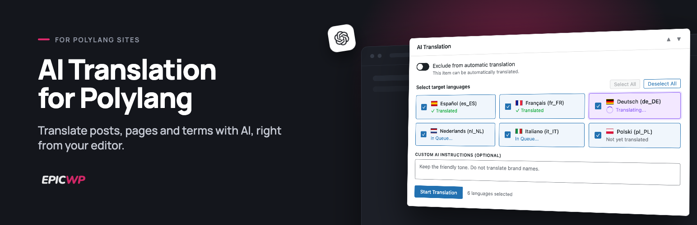
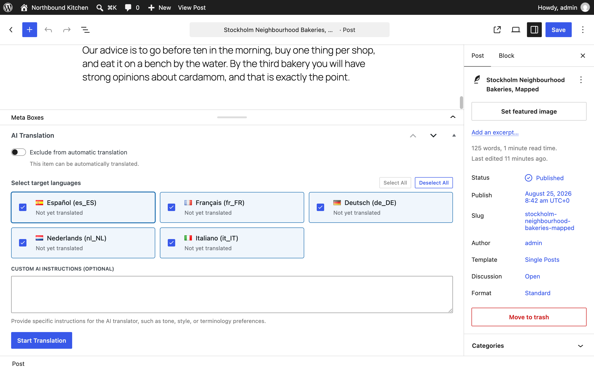
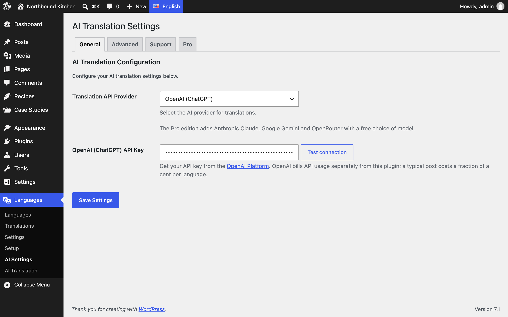
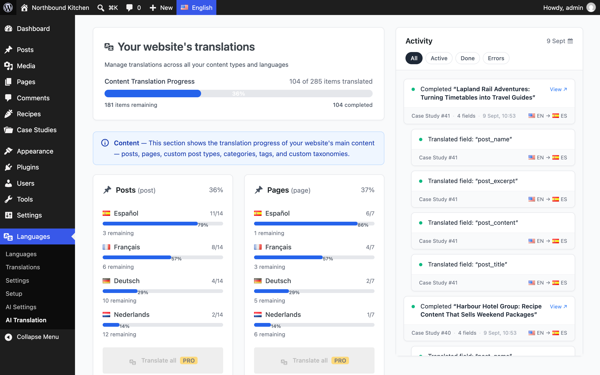
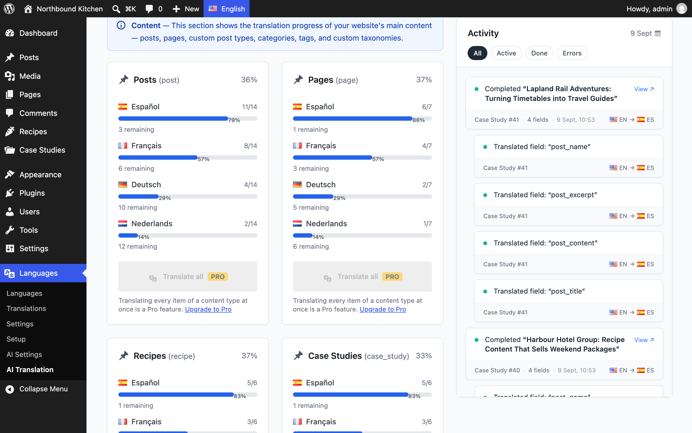
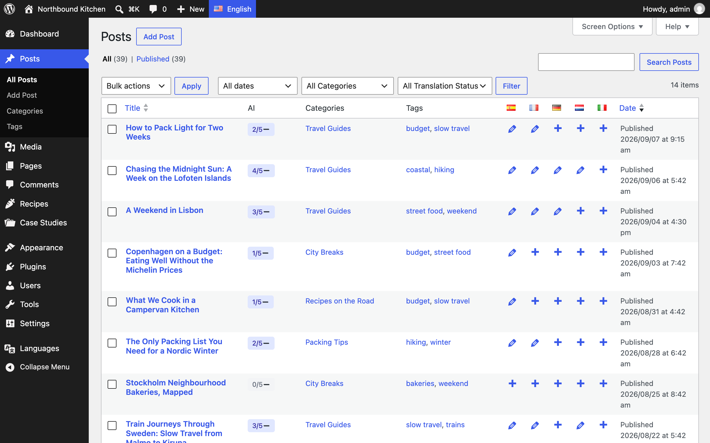

# AI Translation for Polylang

Free WordPress plugin for automatic AI translation with Polylang: translate posts, pages and taxonomy terms into every language you have configured in Polylang with OpenAI, straight from the editor, with your own API key.

This is the free edition of Polylang AI Automatic Translation by EPIC WP. Both editions run the same translation engine; the [Pro edition](#pro-edition) adds bulk and automatic translation, page builder and custom field integrations, more AI providers and SEO meta.

WordPress.org listing: https://wordpress.org/plugins/ai-translation-for-polylang/ (submission in progress)

<!-- TODO once the wordpress.org listing is live, add the plugin badges:

-->

## What it does

AI Translation for Polylang adds a free AI translation box to the WordPress editor. Open a post, page or term, tick the languages you need and click Start Translation: the plugin creates the Polylang translations for you with your own OpenAI API key. There is no account to create with us, no subscription and no usage limit in the plugin. You pay OpenAI for what you translate, which for a normal blog post is a fraction of a cent per language.

Gutenberg blocks and classic editor HTML keep their structure; only the text changes.

- Translates a post, page or custom post type into every language you have configured in Polylang, straight from the edit screen.
- Translates taxonomy terms (categories, tags, custom taxonomies) from the term edit screen: name, description and slug.
- Translates the title, content, excerpt and slug. Gutenberg block markup and classic editor HTML are preserved.
- Optional instructions per translation, for example tone of voice, terms that must stay untranslated or a formal address.
- Detects what changed: after you edit the original, translating again only sends the fields that changed. Tick "Force re-translation" to redo everything.
- Translation status column in the post list: translated, in progress, pending, failed or not started, per post.
- Dashboard under Languages > AI Translation with translation coverage per language and per content type, plus an activity feed of recent translations.
- Preflight checks before a translation starts (OpenAI key, Polylang languages, PHP environment, WP-Cron, loopback requests), so a problem is explained instead of failing silently.
- Error log and optional debug log in the Support tab, so you can see what went wrong and quote it when you ask for help.
- Cleans up after itself: its records are removed when you delete content, and its database tables and options are removed when you delete the plugin.

Translations run in the background through Action Scheduler (bundled), so you can keep working while the box shows progress per language.

### Requirements

- WordPress 5.8 or newer and PHP 8.1 or newer.
- Polylang 3.7 or newer, the free plugin or Polylang Pro.
- An OpenAI account with an API key and billing enabled. See the FAQ for what a translation costs.

## Screenshots

<table>
  <tr>
    <td width="50%"></td>
    <td width="50%"> AI Settings with the OpenAI API key" width="100%"></td>
  </tr>
  <tr>
    <td>The AI Translation box on the post edit screen: pick the target languages, add optional instructions and start the translation.</td>
    <td>Languages > AI Settings with the OpenAI API key.</td>
  </tr>
  <tr>
    <td width="50%"></td>
    <td width="50%"> AI Translation dashboard" width="100%"></td>
  </tr>
  <tr>
    <td>A translated post next to its source.</td>
    <td>The Languages > AI Translation dashboard: coverage per language and content type, and the activity feed.</td>
  </tr>
  <tr>
    <td width="50%"></td>
    <td width="50%"></td>
  </tr>
  <tr>
    <td>Content type cards on the dashboard; translating a whole content type at once is a Pro feature.</td>
    <td>The posts list with the AI column: how many target languages each post is translated into, and a filter by translation status.</td>
  </tr>
</table>

## Installation

1. Install and activate Polylang (or Polylang Pro) and add your languages under Languages > Languages.
2. Install AI Translation for Polylang. Once the WordPress.org listing is live: Plugins > Add New, search for "AI Translation for Polylang", install and activate. Until then: download the ZIP of the latest `vX.Y.Z` tag from the [tags page](https://github.com/epicwp/ai-translation-for-polylang/tags), unzip it, rename the folder to `ai-translation-for-polylang`, upload it to `wp-content/plugins/` and activate the plugin. The tree is the plugin exactly as shipped, including `vendor/` and the built `dist/` bundles, so it runs as is.
3. Go to Languages > AI Settings, paste your OpenAI API key and save. The post types and taxonomies you can translate are the ones you enabled for translation in Polylang.
4. Open a post, page or term. In the AI Translation box, select the target languages and click Start Translation.
5. Follow progress in the box, or on the Languages > AI Translation dashboard.

## Frequently asked questions

**Do I need my own OpenAI account?**
Yes. The plugin sends your content to OpenAI with your own API key. Create an account at platform.openai.com, add a payment method or prepaid credit under Billing, create a key under [API keys](https://platform.openai.com/api-keys) and paste it into Languages > AI Settings. A ChatGPT subscription is not the same thing: the API is billed separately by OpenAI, based on usage.

**What does a translation cost?**
The plugin itself is free and has no usage limits. OpenAI bills you per token at the price of the model. The free edition uses OpenAI's GPT-5.4 Nano model, so a typical 1,000-word post costs well under one cent per language. Long pages and many languages add up proportionally. Your OpenAI usage dashboard shows the exact amounts. Saving your key (and re-running a failed preflight check) sends one tiny test request that also costs a fraction of a cent.

**Where does my content go? Is my data safe?**
Content is sent to the OpenAI API only when you start a translation (plus a one-word test message when you save your key). Nothing is sent to us or to anyone else: the plugin has no telemetry, needs no account and does not phone home. Your API key is stored in your WordPress database like any other setting. Error logs and optional debug logs stay on your server, in `wp-content/uploads/pllat-logs`. How OpenAI handles API data is described in its [terms of use](https://openai.com/policies/terms-of-use) and [privacy policy](https://openai.com/policies/privacy-policy).

**Do I need Polylang? Does it work with Polylang Pro?**
Yes, Polylang 3.7 or newer is required: the plugin uses Polylang's languages and translation links and adds no language system of its own. Both the free Polylang plugin and Polylang Pro are supported.

**Does it work with Elementor, Bricks and other page builders?**
Content written in the block editor or the classic editor is translated. Layouts that a page builder stores in its own fields, such as Elementor and Bricks, are copied unchanged into the translation in the free edition, so the translated page opens in the builder with the original text and you translate it there. The Pro edition translates Elementor and Bricks layouts, ACF fields and WooCommerce products in place.

**Can I translate my whole site at once?**
The free edition translates one post, page or term at a time from its edit screen, into as many languages as you like in one go. Bulk runs across post types and the upcoming Auto-Translate 24/7 are part of the Pro edition.

## Pro edition

AI Translation for Polylang Pro is a separate plugin, sold on our website as Polylang AI Automatic Translation. It adds:

- Bulk translation: pick post types, taxonomies and languages on the dashboard and translate your whole site in one run.
- Auto-Translate 24/7 (upcoming): new and edited content is translated automatically.
- Internal link rewriting: links inside translated content point to the translated pages.
- Elementor, Bricks, ACF and WooCommerce: page builder layouts, custom field groups and products are translated in place.
- Custom field management: scan the custom fields of each post type and decide per field whether it is translated, copied or ignored.
- Polylang string translations for theme and plugin strings.
- Anthropic Claude, Google Gemini and OpenRouter next to OpenAI, with a free choice of model.
- Site-wide AI context and custom instructions applied to every translation.
- SEO meta for Yoast SEO, Rank Math, SEOPress and All in One SEO.
- Premium support and automatic updates through your account on our website.

Both editions share their settings and translation records, so moving to Pro keeps your configuration and existing translations.

**[Upgrade to the Pro edition](https://www.epicwpsolutions.com/upgrade/?utm_source=github&utm_medium=readme&utm_campaign=free)**

Product page with the full feature list: https://www.epicwpsolutions.com/plugins/polylang-automatic-ai-translation/

## Support

- Free edition: post in the [support forum for this plugin on WordPress.org](https://wordpress.org/support/plugin/ai-translation-for-polylang/). The Support tab under Languages > AI Settings has the error log you can quote in your post.
- Pro customers: priority support through the [support desk on our website](https://www.epicwpsolutions.com/support/).

Issues are switched off on this repository and pull requests are closed automatically; see below.

## About this repository

This repository is a one-way export of the free edition's source. The plugin is developed in a private monorepo together with its Pro edition. On every stable release the free edition is exported here as a single commit, tagged with the plugin version (for example `v4.21.4`), so the tag always matches the version you install. Nothing is developed here: changes land in the monorepo and reach this repository with the next stable release.

The tree is the plugin exactly as shipped in the WordPress.org zip, plus what is needed to read and rebuild the minified JavaScript bundles in `dist/admin/`:

- `assets/scripts/`: the JavaScript and JSX sources of the admin bundles
- `assets/images/`: the SVG icons webpack copies into `dist/images/`
- `webpack.config.js`, `package.json`, `package-lock.json`
- `.wordpress-org/assets/`: the banner and screenshots shown on this page

To rebuild the bundles (Node.js 20 or newer):

    npm ci
    npm run build:free

This writes `dist-free/admin/translation-dashboard.js` and `dist-free/admin/single-translator.js` from the sources in `assets/scripts/`, to compare with the shipped bundles in `dist/admin/`. Two differences are expected: the shipped bundles were built by the release pipeline (its Node and dependency versions), and the monorepo build rewrites the text domain literal `polylang-ai-automatic-translation` to `ai-translation-for-polylang` in them afterwards. The stylesheet `dist/admin/admin.css` is compiled from Tailwind sources that live in the monorepo and is not rebuilt here.

## License

GPLv2 or later. See `LICENSE`.
